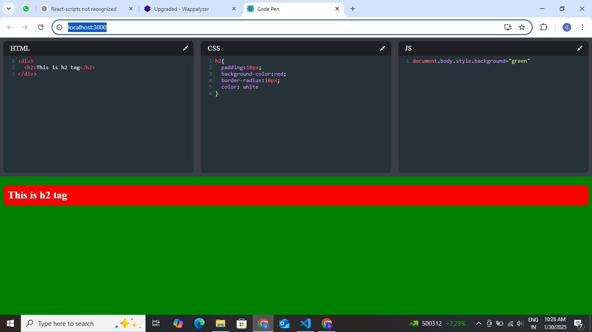

# React CodePen Clone

## Overview

React CodePen Clone is a web-based code editor that allows users to write and preview HTML, CSS, and JavaScript in real time. This project aims to provide an intuitive and efficient environment for developers to experiment with front-end code and see immediate results.
## Features

### 1. Real-time code preview
- Instantly see the output as you write HTML, CSS, and JavaScript.

### 2. Separate code editors
- Organized editors for HTML, CSS, and JavaScript with syntax highlighting.

### 3. Code execution
- Runs JavaScript code dynamically within the browser.

### 4. Responsive layout
- Ensures an optimal experience across various screen sizes.

### 5. Local storage support
- Saves code automatically so users can continue their work later.

---

## Installation

- To set up the project locally, follow these steps:

---

## How to Run

### 1. Prerequisites
Ensure you have the following installed on your machine:

- Node.js (LTS version recommended)
- npm (comes with Node.js)

### 2. Installation
1. Clone the repository:
  
   git clone https://github.com/Govardhanit1234/CodePenPro.git
2. Navigate to the project directory:
 
   cd react-codepen-clone
3. Install dependencies:

   npm install
4.  Start the development server:

   npm start

### 3. Usage
- Write your HTML, CSS, and JavaScript code in the respective editor sections.
- The output updates in real-time as you type.
- Your work is saved in local storage, allowing you to pick up where you left off.

### 4. Technologies Used

1. React.js 

  Front-end library for building UI components

2. CodeMirror

  Syntax highlighting and code editor support

3. React.js

   Styling the user interface

4. React.js 

  Dynamic behavior and interactivity
  

## Screenshots

### *1. Code Editor Page*

